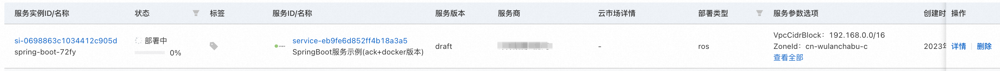
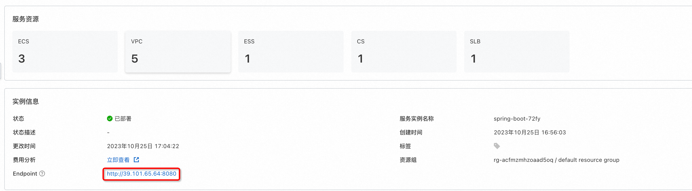

# 服务模版说明文档

## 服务说明

本文介绍springboot服务ack+docker版快速上手流程，本示例对应的[git地址](https://github.com/aliyun-computenest/springboot-ack-docker-demo)

本示例会自动的构建计算巢服务，具体的服务构建流程为:

1. 构建并上传docker镜像，创建计算巢容器镜像部署物
2. 创建计算巢服务并关联容器镜像部署物

创建过程大约持续1分钟，当服务变成待提交后构建成功

## 服务架构

本部署架构为ack集群部署，将docker镜像以service的方式部署到ack集群中，通过service绑定的loadBalancer的公网ip进行访问，在本例中，service提供的对外端口为8080，和容器对外提供的端口相同。


## 服务构建计费说明

测试本服务构建无需任何费用，创建服务实例涉及的费用参考服务实例计费说明

## RAM账号所需权限

本服务需要对ACK、ECS、VPC等资源进行访问和创建操作，若您使用RAM用户创建服务实例，需要在创建服务实例前，对使用的RAM用户的账号添加相应资源的权限。添加RAM权限的详细操作，请参见[为RAM用户授权](https://help.aliyun.com/document_detail/121945.html)。所需权限如下表所示。

| 权限策略名称                          | 备注              |
|---------------------------------|-----------------|
| AliyunCSFullAccess             | 管理容器服务(CS)的权限    |
| AliyunECSFullAccess             | 管理云服务器服务（ECS）的权限 |
| AliyunVPCFullAccess             | 管理专有网络（VPC）的权限  |
| AliyunROSFullAccess             | 管理资源编排服务（ROS）的权限 |
| AliyunComputeNestUserFullAccess | 管理计算巢服务（ComputeNest）的用户侧权限 |
| AliyunComputeNestSupplierFullAccess | 管理计算巢服务（ComputeNest）的服务商侧权限 |


## 服务实例计费说明

测试本服务在计算巢上的费用主要涉及：

- ack集群费用
- 所选vCPU与内存规格
- 系统盘类型及容量
- 公网带宽

计费方式包括：

- 按量付费（小时）
- 包年包月

目前提供如下实例：

| 规格族 | vCPU与内存 | 系统盘 | 公网带宽 |
| --- | --- | --- | --- |
| ecs.c6.large | 内存型c6，2vCPU 4GiB | ESSD云盘 200GiB PL0 | 固定带宽1Mbps |
| ecs.c6.2large | 内存型c6，4vCPU 8GiB | ESSD云盘 200GiB PL0 | 固定带宽1Mbps |

预估费用在创建实例时可实时看到。

## 服务实例部署流程

### 部署参数说明

| 参数组          | 参数项               | 说明                                                                     |
|--------------|-------------------|------------------------------------------------------------------------|
| 服务实例         | 服务实例名称            | 长度不超过64个字符，必须以英文字母开头，可包含数字、英文字母、短划线（-）和下划线（_）                          |
|              | 地域                | 服务实例部署的地域                                                              |
| 付费类型配置       | 付费类型              | 资源的计费类型：按量付费和包年包月                                                      |
| 基础配置         | 可用区               | ACK集群所在可用区                                                             |
|              | 专有网络IPv4网段        | VPC的ip地址段范围，创建VPC时使用                                                   |
|              | 交换机子网网段           | VSwitch的ip地址段范围，必须是VPC网段的子网段                                           |
|              | 实例密码              | 长度8-30，必须包含三项（大写字母、小写字母、数字、 ()`~!@#$%^&*-+=&#124;{}[]:;'<>,.?/ 中的特殊符号） |
| Kubernetes配置 | Worker节点规格        | ACK集群中节点使用的实例规格                                                        |
|              | Worker 系统盘磁盘类型    | ACK集群中节点使用的系统盘磁盘类型                                                     |
|              | Worker节点系统盘大小(GB) | ACK集群中节点使用的系统盘磁盘大小                                                     |
|              | Service CIDR      | ACK集群中service可用网段，不能与 VPC 及 VPC 内已有 Kubernetes 集群使用的网段重复               |
|              | Pod 网络 CIDR       | ACK集群中pod可用网段，不能与 VPC 及 VPC 内已有 Kubernetes 集群使用的网段重复                   |
| 负载均衡配置       | 规格                | 负载均衡规格                                                                 |

### 部署步骤

0. 部署链接

1. 单击部署链接，进入服务实例部署界面，根据界面提示，填写参数完成部署。

2. 参数填写完成后可以看到对应询价明细，确认参数后点击**下一步：确认订单**。

3.  确认订单完成后同意服务协议并点击**立即创建**
    进入部署阶段。

4. 等待部署完成后就可以开始使用服务，进入服务实例详情点击visitUrl。

5. 部署结果


## 服务详细说明

本文通过将[代码](https://atomgit.com/flow-example/spring-boot)构建后，将deploy.sh和application.jar打包成package.tgz,对其中的application.jar打包成docker镜像,
通过计算巢部署物上传为容器镜像部署物，在模版中创建ACK集群，将容器镜像部署物部署到ACK集群上。

package.tgz打包为docker镜像对应的Dockerfile如下：

```
FROM centos

# 更新yum源地址
RUN cd /etc/yum.repos.d/ && \
    sed -i 's/mirrorlist/#mirrorlist/g' /etc/yum.repos.d/CentOS-* && \
    sed -i 's|#baseurl=http://mirror.centos.org|baseurl=http://vault.centos.org|g' /etc/yum.repos.d/CentOS-* && \
    yum makecache

RUN yum update -y && \
    yum install -y java-1.8.0-openjdk java-1.8.0-openjdk-devel && \
    yum install -y git && \
    yum clean all && \
    cd /root && \
    git clone https://github.com/aliyun-computenest/springboot-ack-docker-demo.git && \
    mkdir -p /home/admin/application && \
    cp /root/springboot-ack-docker-demo/artifacts/package.tgz /home/admin/application && \
    cd /home/admin/application && \
    tar xvf package.tgz && \
    rm -rf /root/springboot-ack-docker-demo && \
    rm package.tgz
WORKDIR /home/admin/application/target
ENV JAVA_HOME /usr/lib/jvm/java-1.8.0-openjdk/
RUN export JAVA_HOME
EXPOSE 8080
CMD ["java", "-jar", "application.jar"]
```

templates/template.yaml主要由三部分组成

1.Parameters定义需要用户填写的参数，包括付费类型，ACK实例规格和实例密码可用区等参数
```
Parameters:
  PayType:
    Type: String
    Label:
      en: ECS Instance Charge Type
      zh-cn: 付费类型
    Default: PostPaid
    AllowedValues:
      - PostPaid
      - PrePaid
    AssociationProperty: ChargeType
    AssociationPropertyMetadata:
      LocaleKey: InstanceChargeType
  PayPeriodUnit:
    Type: String
    Label:
      en: Pay Period Unit
      zh-cn: 购买资源时长周期
    Default: Month
    AllowedValues:
      - Month
      - Year
    AssociationProperty: PayPeriodUnit
    AssociationPropertyMetadata:
      Visible:
        Condition:
          'Fn::Not':
            'Fn::Equals':
              - '${PayType}'
              - PostPaid
  PayPeriod:
    Type: Number
    Description:
      en: >-
        When the resource purchase duration is Month, the value of Period ranges
        from 1 to 9, 12, 24, 36, 48, or 60. <br><b><font color='red'> When ECS
        instance types are PrePaid valid </b></font>
      zh-cn: >-
        当购买资源时长为Month时，Period取值：1~9 <br><b><font
        color='red'>当ECS实例类型为PrePaid有效</b></font>
    Label:
      en: Period
      zh-cn: 购买资源时长
    Default: 1
    AllowedValues:
      - 1
      - 2
      - 3
      - 4
      - 5
      - 6
      - 7
      - 8
      - 9
    AssociationProperty: PayPeriod
    AssociationPropertyMetadata:
      Visible:
        Condition:
          'Fn::Not':
            'Fn::Equals':
              - '${PayType}'
              - PostPaid
  ZoneId:
    Type: String
    AssociationProperty: 'ALIYUN::ECS::Instance:ZoneId'
    Label:
      en: Zone ID
      zh-cn: 可用区
    Default: cn-hangzhou-h
  VpcCidrBlock:
    Type: String
    Label:
      en: VPC CIDR IPv4 Block
      zh-cn: 专有网络IPv4网段
    Description:
      zh-cn: >-
        VPC的ip地址段范围，<br>您可以使用以下的ip地址段或其子网:<br><font
        color='green'>[10.0.0.0/8]</font><br><font
        color='green'>[172.16.0.0/12]</font><br><font
        color='green'>[192.168.0.0/16]</font>
      en: >-
        The ip address range of the VPC in the CidrBlock form; <br>You can use
        the following ip address ranges and their subnets: <br><font
        color='green'>[10.0.0.0/8]</font><br><font
        color='green'>[172.16.0.0/12]</font><br><font
        color='green'>[192.168.0.0/16]</font>
    Default: 192.168.0.0/16
    AssociationProperty: 'ALIYUN::VPC::VPC::CidrBlock'
  VSwitchCidrBlock:
    Type: String
    Label:
      en: VSwitch CIDR Block
      zh-cn: 交换机子网网段
    Description:
      zh-cn: 必须属于VPC的子网段。
      en: Must belong to the subnet segment of VPC.
    Default: 192.168.1.0/24
    AssociationProperty: 'ALIYUN::VPC::VSwitch::CidrBlock'
    AssociationPropertyMetadata:
      VpcCidrBlock: VpcCidrBlock
  LoginPassword:
    NoEcho: true
    Type: String
    Description:
      en: >-
        Server login password, Length 8-30, must contain three(Capital letters,
        lowercase letters, numbers, ()`~!@#$%^&*_-+=|{}[]:;<>,.?/ Special symbol
        in)
      zh-cn: >-
        服务器登录密码,长度8-30，必须包含三项（大写字母、小写字母、数字、 ()`~!@#$%^&*_-+=|{}[]:;<>,.?/
        中的特殊符号）
    Label:
      en: Instance Password
      zh-cn: 实例密码
    ConstraintDescription:
      en: >-
        Length 8-30, must contain three(Capital letters, lowercase letters,
        numbers, ()`~!@#$%^&*_-+=|{}[]:;<>,.?/ Special symbol in)
      zh-cn: '长度8-30，必须包含三项（大写字母、小写字母、数字、 ()`~!@#$%^&*_-+=|{}[]:;<>,.?/ 中的特殊符号）'
    AssociationProperty: 'ALIYUN::ECS::Instance::Password'
    AllowedPattern: '^[a-zA-Z0-9-\(\)\`\~\!\@\#\$\%\^\&\*\_\-\+\=\|\{\}\[\]\:\;\<\>\,\.\?\/]*$'
    MinLength: 8
    MaxLength: 30
    Default: computenest*12345
  WorkerInstanceType:
    Type: String
    Label:
      en: Worker Nodes Types
      zh-cn: Worker节点规格
    AssociationProperty: 'ALIYUN::ECS::Instance::InstanceType'
    AssociationPropertyMetadata:
      ZoneId: '${ZoneId}'
    Default: ecs.g6.large
  WorkerSystemDiskCategory:
    Type: String
    AllowedValues:
      - cloud_efficiency
      - cloud_ssd
      - cloud_essd
    AssociationPropertyMetadata:
      LocaleKey: DiskCategory
      InstanceType: '${WorkerInstanceType}'
    Label:
      en: Worker System Disk Category
      zh-cn: Worker 系统盘磁盘类型
    Default: cloud_essd
  WorkerSystemDiskSize:
    Type: Number
    Label:
      en: Worker System Disk Size(GB)
      zh-cn: Worker节点系统盘大小(GB)
    MinValue: 1
    Default: 120
  PodCidr:
    Type: String
    Description:
      zh-cn: >-
        请填写有效的私有网段，即以下网段及其子网：10.0.0.0/8，172.16-31.0.0/12-16，192.168.0.0/16<br>不能与
        VPC 及 VPC 内已有 Kubernetes 集群使用的网段重复。<font
        color='blue'><b>创建成功后不能修改</b></font>
      en: >-
        Please fill in a valid private segment, i.e. the following segments and
        their subnets: 10.0.0.0/8, 172.16-31.0.0/12-16, 192.168.0.0/16<br> which
        cannot duplicate the network segments already used by clusters in VPC
        and VPC Kunetberes. <font color='blue'><b>Cannot be modified after
        successful creation</b></font>
    Label:
      zh-cn: Pod 网络 CIDR
      en: Pod Network CIDR
    AssociationProperty: 'ALIYUN::CS::ManagedKubernetesCluster::PodCidr'
    Default: 10.0.0.0/16
  ServiceCidr:
    Type: String
    Description:
      zh-cn: >-
        可选范围：10.0.0.0/16-24，172.16-31.0.0/16-24，192.168.0.0/16-24<br>不能与 VPC 及
        VPC 内已有 Kubernetes 集群使用的网段重复。<font color='blue'><b>创建成功后不能修改</b></font>
      en: >-
        Optional range: 10.0.0.0/16-24, 172.16-31.0.0/16-24,
        192.168.0.0/16-24<br> cannot duplicate segments already used by existing
        Kubernetes clusters in VPC and VPC.<font color='blue'><b>Cannot be
        modified after successful creation</b></font>
    Label:
      zh-cn: Service CIDR
      en: Service CIDR
    AssociationProperty: 'ALIYUN::CS::ManagedKubernetesCluster::ServiceCidr'
    Default: 172.16.0.0/16
  LoadBalancerSpec:
    Type: String
    AssociationProperty: ALIYUN::SLB::Instance::InstanceType
    Label:
      en: Specifications
      zh-cn: 规格
    Default: slb.s1.small
```

2.Resources定义需要开的资源，包括新开的vpc、loadBalancer、ack集群。ALIYUN::CS::ClusterApplication资源类型会将镜像按yaml文件部署到ACK集群中，其中{{ computenest::acr::dockerconfigjson }}是下载docker所需secret的占位符，计算巢服务会在部署时替换为对应的下载秘钥。{{ computenest::acrimage::demo }} 是容器镜像仓库的占位符，计算巢服务会替换成对应的镜像仓库地址。
```
Resources:
  EcsVpc:
    Type: 'ALIYUN::ECS::VPC'
    Properties:
      VpcName:
        Ref: 'ALIYUN::StackName'
      CidrBlock:
        Ref: VpcCidrBlock
  EcsVSwitch:
    Type: 'ALIYUN::ECS::VSwitch'
    Properties:
      VSwitchName:
        Ref: 'ALIYUN::StackName'
      VpcId:
        Ref: EcsVpc
      ZoneId:
        Ref: ZoneId
      CidrBlock:
        Ref: VSwitchCidrBlock
  # 新建负载均衡
  Slb:
    Type: ALIYUN::SLB::LoadBalancer
    Properties:
      LoadBalancerName:
        Ref: ALIYUN::StackName
      PayType:
        Ref: PayType
      PricingCycle:
        Ref: PayPeriodUnit
      Duration:
        Ref: PayPeriod
      VpcId:
        Ref: EcsVpc
      VSwitchId:
        Ref: EcsVSwitch
      LoadBalancerSpec:
        Ref: LoadBalancerSpec
      AddressType: intranet
  # 新建eip
  EipSlbAddress:
    Type: ALIYUN::VPC::EIP
    Properties:
      Name:
        Ref: ALIYUN::StackName
      InternetChargeType: PayByTraffic
      Bandwidth: 100
  # 绑定eip到负载均衡
  EipSlbAddressAssociation:
    Type: ALIYUN::VPC::EIPAssociation
    Properties:
      InstanceId:
        Ref: Slb
      AllocationId:
        Ref: EipSlbAddress
  EcsSecurityGroup:
    Type: 'ALIYUN::ECS::SecurityGroup'
    Properties:
      SecurityGroupName:
        Ref: 'ALIYUN::StackName'
      VpcId:
        Ref: EcsVpc
      SecurityGroupEgress:
        - PortRange: '-1/-1'
          Priority: 1
          IpProtocol: all
          DestCidrIp: 0.0.0.0/0
          NicType: intranet
      SecurityGroupIngress:
        - PortRange: '-1/-1'
          Priority: 1
          IpProtocol: all
          SourceCidrIp:
            Ref: PodCidr
          Description: pod网络访问开放
          NicType: intranet
        - PortRange: '-1/-1'
          Priority: 1
          IpProtocol: all
          SourceCidrIp:
            Ref: VpcCidrBlock
          Description: vpc网络访问开放
          NicType: intranet
        - PortRange: '-1/-1'
          Priority: 1
          IpProtocol: icmp
          SourceCidrIp: 0.0.0.0/0
          Description: icmp协议端口放开
          NicType: intranet
  ManagedKubernetesCluster:
    Type: 'ALIYUN::CS::ManagedKubernetesCluster'
    Properties:
      Name:
        Ref: 'ALIYUN::StackName'
      ChargeType:
        Ref: PayType
      Period:
        Ref: PayPeriod
      PeriodUnit:
        Ref: PayPeriodUnit
      VSwitchIds:
        - Ref: EcsVSwitch
      VpcId:
        Ref: EcsVpc
      WorkerInstanceTypes:
        - Ref: WorkerInstanceType
      NumOfNodes: 3
      ClusterSpec: ack.pro.small
      ContainerCidr:
        Ref: PodCidr
      ServiceCidr:
        Ref: ServiceCidr
      ZoneIds:
        - Ref: ZoneId
      SecurityGroupId:
        Ref: EcsSecurityGroup
      WorkerSystemDiskCategory:
        Ref: WorkerSystemDiskCategory
      WorkerSystemDiskSize:
        Ref: WorkerSystemDiskSize
      LoginPassword:
        Ref: LoginPassword
      SnatEntry: true
      Addons:
        - Name: flannel
          Config: ''
  ClusterApplication:
    Type: ALIYUN::CS::ClusterApplication
    Properties:
      YamlContent:
        Fn::Sub:
          - |
            apiVersion: v1
            data:
              .dockerconfigjson: {{computenest::acr::dockerconfigjson}}
            kind: Secret
            metadata:
              name: docker-secret
            type: kubernetes.io/dockerconfigjson
            ---
            apiVersion: apps/v1
            kind: Deployment
            metadata:
              name: spring-boot
              labels:
                app: spring-boot
            spec:
              replicas: 1
              selector:
                matchLabels:
                  app: spring-boot
              template:
                metadata:
                  labels:
                    app: spring-boot
                spec:
                  containers:
                    - name: spring-boot
                      image: {{ computenest::acrimage::springBootDemo }}
                  imagePullSecrets:
                    - name: docker-secret
            ---
            apiVersion: v1
            kind: Service
            metadata:
              annotations:
                service.beta.kubernetes.io/alibaba-cloud-loadbalancer-id: ${LoadBalancerId}
                service.beta.kubernetes.io/alicloud-loadbalancer-force-override-listeners: "true"
              labels:
                app: spring-boot
              name: spring-boot-svc
            spec:
              ports:
              - port: 8080
                protocol: TCP
                targetPort: 8080
              selector:
                app: spring-boot
              type: LoadBalancer
          - LoadBalancerId:
              Fn::GetAtt:
                - Slb
                - LoadBalancerId
      ClusterId:
        Fn::GetAtt:
          - ManagedKubernetesCluster
          - ClusterId
      DefaultNamespace: default
```

3.Outputs定义需要最终在计算巢概览页中对用户展示的输出，展示springboot的访问地址，负载均衡地址加服务端口
```
Outputs:
  # 将公网ip做为http返回的地址显示在控制台
  Endpoint:
    Description:
      zh-cn: 对外暴露的公网IP地址
      en: Public IP Addresses
    Value:
      Fn::Sub:
        - http://${ServerAddress}:8080
        - ServerAddress:
            Fn::GetAtt:
              - EipSlbAddress
              - EipAddress
```

## 其他

[实例代码源地址](https://atomgit.com/flow-example/spring-boot)

[软件包package.tgz构建流程参考](https://help.aliyun.com/document_detail/153848.html)